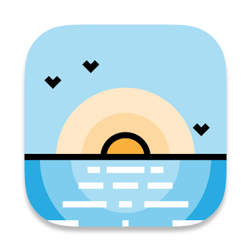

# Ashore

<p align="center">
  
</p>

<p align="center">
  一个专注、跨平台、基于 aria2 与 PyQt6 的桌面下载管理器。
</p>

<p align="center">
  <a href="README.md">English</a>
</p>

<p align="center">
  
  
  
</p>

## 项目简介

Ashore 是 [aria2](https://github.com/aria2/aria2) 的桌面图形前端。项目刻意保持边界清晰：把下载管理本身做好，只暴露日常真正需要的 aria2 能力，并尽量让不同桌面平台上的行为保持一致。

Ashore 使用 aria2 JSON-RPC 作为任务状态的权威来源，并使用 WebSocket 通知触发即时刷新。同时提供任务名称持久化、Tracker 来源管理与健康检测、系统通知、主题、单实例路由以及桌面协议/文件关联等功能。

## 主要功能

- 通过 aria2 支持 HTTP、HTTPS、FTP、BitTorrent、Magnet 与本地 `.torrent` 文件
- 基于 PyQt6 的紧凑桌面界面，支持浅色、深色与跟随系统主题
- 在主界面统一展示任务状态、速度、aria2 连接状态和常用操作
- WebSocket 用于即时通知，HTTP 轮询作为权威状态与断线恢复路径
- 支持多个 BT Tracker 来源合并、去重、手动维护与可达性/延迟检测
- RPC 默认仅本机访问；外部访问必须显式开启，并显示自动生成的只读授权令牌
- 下载完成或错误时发送系统通知
- 持久化已学习到的下载任务名称
- 单实例处理 URL、Magnet 与 `.torrent` 文件
- 支持简体中文、繁体中文与英语界面；首次运行优先匹配系统语言，无法匹配时默认使用英语
- Linux、macOS、Windows 代码路径均纳入 CI

## 平台状态

| 平台 | 当前状态 |
| --- | --- |
| Linux | 主要开发与人工验收平台 |
| macOS | 代码与打包支持已具备，可生成 App/DMG |
| Windows | 已覆盖代码与 CI，正式发布前仍希望增加实体机验收 |

从源码运行需要 **Python 3.12+**，下载功能需要系统中存在可用的 **aria2**。发布版 Ashore 可以先于 aria2 安装；若启动时未检测到 aria2，Ashore 会显示当前系统对应的安装提示。

## 安装

正式 Release 可用后，优先使用预构建产物。发布内容见仓库 [Releases](https://github.com/Kai-x64/Ashore/releases)。

### Linux

解压 Ashore Linux 发布包，然后执行：

```bash
sudo ./install.sh
```

安装程序会将 Ashore 放到 `/opt/Ashore`，桌面入口放到 `/usr/local/share/applications/ashore.desktop`。用户配置继续保存在 `~/.config/ashore/`；若设置了 `XDG_CONFIG_HOME`，则使用对应目录。

如果启动 Ashore 时系统尚未安装 aria2，程序会显示缺失依赖状态和当前系统推荐的安装命令。安装 aria2 后，可使用“重新检测”继续进入主界面。

### macOS

先安装 aria2。使用发布包时，打开 Ashore DMG，并将 `Ashore.app` 拖入 `Applications`。

### Windows

Windows 已纳入自动化测试，但目前尚未提供正式安装器。在 Windows 打包流程完成前，从源码运行仍是开发方式。

## 从源码运行

```bash
git clone https://github.com/Kai-x64/Ashore.git
cd Ashore

python3 -m venv .venv
source .venv/bin/activate
python -m pip install -e ".[dev]"

python Ashore.py
```

Windows 请使用对应的虚拟环境激活命令。

## 配置与 RPC

Ashore 的用户配置存放在源码目录之外。RPC 默认只允许本机访问。只有在设置页中明确打开“允许外部访问 RPC”后，Ashore 才会生成授权令牌，并以只读形式显示。

设置页会显示 Ashore 实际使用的 HTTP 轮询地址、WebSocket 通知地址、连接状态与 aria2 版本。HTTP 始终是任务状态的权威来源，WebSocket 只负责触发及时刷新。

详细说明见 [RPC 与安全](docs/rpc.md)。

## Tracker 管理

Ashore 可以合并多个 Tracker 来源、自动去重，在更新失败时保留最近一次成功列表，并发检测各 Tracker 的可达性和延迟。自动更新是可选功能，并依据“上次成功更新时间”判断是否需要刷新，不会每次启动都重新下载。

## 开发

安装开发依赖：

```bash
python -m pip install -e ".[dev]"
```

运行与 CI 对应的核心检查：

```bash
python -m compileall -q Ashore.py paths.py make.py core interface
python -m pyflakes Ashore.py paths.py make.py core interface tests
python -m unittest discover -s tests -v
```

仓库保持应用逻辑与界面分离：

- `Ashore.py`：应用启动入口
- `core/`：aria2 集成、生命周期、配置、Tracker、请求与平台无关服务
- `interface/`：PyQt6 窗口、页面、控件、主题、通知和窗口边框
- `packaging/`：桌面打包元数据与 Linux 安装脚本
- `tests/`：单元测试、界面结构测试、跨平台行为与打包测试

更多内容见 [架构说明](docs/architecture.md) 与 [开发指南](docs/development.md)。

## 打包

Linux 支持 PyInstaller `onefile` 与 `onedir`；macOS 支持 `.app` 与 DMG。

```bash
python make.py onefile   # Linux
python make.py onedir    # Linux
python make.py app       # macOS
python make.py dmg       # macOS
```

发布目录与验收说明见 [打包说明](docs/packaging.md)。

## 后续规划

Ashore 会继续保持“小而可靠的 aria2 桌面管理器”这一定位，不计划把项目扩张为插件或服务生态。包括未来可能使用 C++/Qt 重新实现 Ashore 在内的长期想法，统一记录在 [Roadmap](docs/roadmap.md)。

## 许可证

Ashore 使用 [Mozilla Public License 2.0](LICENSE)。
