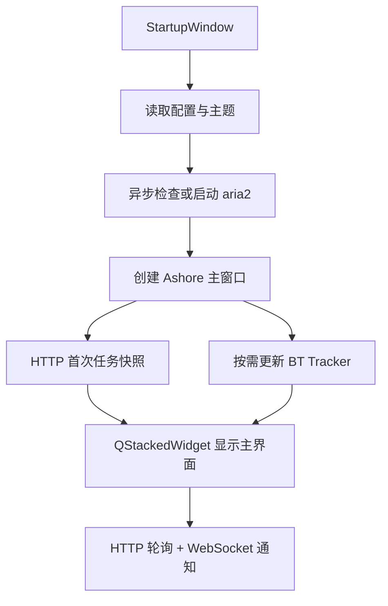

# Ashore 项目交接（2026-10-05）

## 1. 当前结论

Ashore 的启动和退出持续显示忙碌光标问题已经解决，并由用户在 Ubuntu GNOME Wayland、PyQt6 6.11.0 / Qt 6.11.0 环境中实际确认：**启动不再转圈，退出也不再转圈**。

启动问题最终不是 aria2、BT Tracker、开屏界面、图标或具体页面造成的，而是主窗口使用了含页面的 `QStackedLayout`：

- 空 `QStackedLayout`：不转；
- 加入一个或多个空页面：转；
- 改用 `QStackedWidget`，加入空页面：不转；
- 改用 `QStackedWidget`，加载两个真实下载页和完整设置页：不转；
- 正式代码改用 `QStackedWidget` 后，用户确认真实 Ashore 启动不转。

退出问题采用正式的 `ExitWindow` 生命周期界面解决。它等待退出窗口完成激活和首次绘制后再开始异步清理，不使用固定延迟。

本轮用于定位问题的 `diagnostics/`、Probe 脚本、专用测试和 `ASHORE_STARTUP_TRACE` 已全部删除；CI 也不再引用它们。不要重新加入旧的诊断分支、双实现或延迟规避方案。

当前远端状态：

- 仓库：`FatesEdge/Ashore`
- 开发分支：`codex/python-stability-refactor`
- 当前功能基线提交：`e6342b37fab0a0b600c92d548a0ddd2dbec495b3`
- 功能基线说明：`Replace stacked layout and remove diagnostics`
- 版本：`0.7.67`
- `main` 尚未在本轮合并，合并前需要用户确认。

## 2. 下一会话的首要任务：重新设计按钮和交互视觉

用户已经确认程序不再转圈，但明确认为当前按钮仍然很丑，而且此前提出的按钮设计问题没有得到真正改善。下一会话应先处理视觉方案，**不要直接继续堆 QSS 补丁**。

开始修改前应联网查找并比较成熟的 Qt/PyQt/PySide 桌面应用设计素材，重点参考：

- 下载管理器、文件管理器和设置页的工具栏按钮；
- GNOME、KDE、Fluent、Material 等桌面设计中主按钮、次按钮、危险按钮和纯图标按钮的层级；
- Qt 官方样式表、Qt Widgets Gallery 及成熟开源 Qt 应用的按钮状态；
- 可复用主题库或组件库时，必须核对许可证、PyQt6/PySide6 兼容性、打包成本和长期维护风险。

先给用户提供 2～3 套有截图或链接依据的视觉方向，再确认一种后修改。不要仅仅换一个背景色或继续把所有按钮统一套成有色边框。

应重点解决：

1. 顶部“新建、开始全部、暂停全部”图标按钮缺少设计层级。
2. 左侧下载中、已完成、设置导航虽然已有选中状态，但高亮效果仍不够精致。
3. 设置页普通操作、保存操作、复制操作和危险操作不应完全长得一样。
4. 浅色主题应明显是浅色界面，深色主题应保持对比度；主题色用于重点状态，不应淹没所有控件。
5. Hover、Pressed、Checked、Disabled、Focus 状态需要统一。
6. 边框、圆角、内边距、图标尺寸和控件高度应形成统一尺度。
7. 横向拉宽窗口时，下载目录、User Agent、BT Tracker、RPC 令牌等长字段继续伸展；短选项保持合适宽度。
8. 保留现有彩色/灰色托盘图标选项，不改成单色托盘方案。

可以考虑把按钮样式从当前 `ThemeManager.styleSheet()` 中的全局 `QPushButton` 规则拆成清晰的语义属性，例如工具栏、导航、主要操作、次要操作、危险操作；但应一次性形成完整规则，不保留新旧两套重叠样式。

## 3. 当前功能状态

### aria2 与任务管理

- 使用自行实现的 HTTP JSON-RPC 客户端，不依赖旧的 `aria2p`。
- HTTP 定时查询仍是任务状态的最终来源。
- WebSocket 通知已实现，用于在 aria2 事件发生时立即触发刷新；断开时仍保留 HTTP 查询。
- 设置页和主窗口状态栏显示 aria2 连接状态；连接标签使用红/绿底色和白字。
- 设置页显示实际使用的 HTTP 与 WebSocket 地址，不允许用户在该显示项中直接修改。
- aria2 缺失时会显示明确错误并退出。
- 本地 `.torrent` 文件使用 `aria2.addTorrent`。
- 磁链/种子父任务和实际 payload 会合并显示，避免界面出现两个逻辑任务。
- 任务名称按 GID 持久化；轮询失败不会清空名称，aria2 获得真实元数据后会更新旧名称。
- 删除任务只删除 aria2 明确列出的下载文件，拒绝模糊的广泛删除路径。
- `check-integrity=true` 默认启用，不在 Ashore 设置页暴露。
- `force-save=false`，避免下载完成后继续保留无意义的 `.aria2` 控制文件；下载中的 `.aria2` 文件属于 aria2 的断点续传状态，不能在下载过程中随意删除。

### RPC 与浏览器集成

- RPC 默认只监听本机：`rpc-listen-all=false`。
- 开启“允许外部访问 RPC”后自动生成随机令牌。
- 令牌只读，可显示和复制，不能在界面中修改；关闭外部访问时会移除令牌。
- RPC 端口或令牌变化后，Ashore 尝试安全接管/重启 aria2；失败时保存配置并明确要求用户手动重启。
- `bale/ashore.desktop` 已关联 `magnet:` 和 `.torrent`。
- 普通 HTTP/HTTPS 浏览器下载不能仅靠 desktop 协议关联拦截，需要 Firefox 扩展（例如 Aria2 Integration）通过 RPC 发送 URL、请求头等信息。
- 某些下载依赖浏览器 Cookie、登录状态、临时 URL 或请求头，未来浏览器集成应允许用户选择交给 Ashore 或继续由 Firefox 下载。

### 设置、主题和本地化

- 语言选项：简体中文、繁体中文、英语。
- User Agent 使用可编辑下拉框；完整预设保存在 `config/ashore.conf`，也允许手动输入。
- 主题模式：跟随系统、浅色、深色。
- 支持主题色预设；当前实现集中在 `interface/themeManager.py`，但按钮视觉仍需重做。
- 托盘图标选项：彩色、灰色。
- 设置页中的下载目录、User Agent、BT Tracker、RPC 令牌属于可伸展长字段；短选项应保持紧凑。
- RPC 令牌使用固定长度圆点掩码，避免直接显示难看的完整点串。

### BT Tracker

- 首次运行若没有成功记录，会自动获取一次 Tracker。
- 用户可选择是否自动更新。
- 自动更新开启时，距离上次成功超过 24 小时才在启动阶段更新。
- 启动界面最多等待约 1 秒；超时或失败不会阻止进入主界面。
- 成功后保存更新时间和实际来源；失败保留旧列表、旧来源和旧成功时间。
- Tracker 响应会校验 `announce` URL 并去重，网页内容或无效来源不会直接写入配置。

### 启动、退出、通知和路径

- `StartupWindow` 显示启动图片、当前准备阶段文字和不确定进度条。
- 主窗口首次绘制后才注册托盘和检查旧下载目录迁移。
- `ExitWindow` 提供退出反馈，随后异步等待轮询线程和 aria2 清理。
- 下载完成/失败通过 `QSystemTrayIcon.showMessage()` 发送系统通知。
- 源码方式运行时通知可能显示 `python3` 图标；PyInstaller 打包版本已验证可以显示 Ashore 图标。声音由桌面通知设置决定。
- 首次配置通过系统接口/`xdg-user-dir DOWNLOAD` 获取用户下载目录，不再硬编码 `/home/panzk/Downloads`。
- 仅检测到历史硬编码默认目录时才提供迁移；用户自定义目录不会被覆盖。

### 打包和 CI

- `make.py` 支持 `onefile`、`onedir`，macOS 还支持 `app`、`dmg`。
- Linux `onefile` 输出：`dist/Ashore.Linux.onefile/`。
- 包中包含可执行文件、图标、desktop 文件和 `install.sh`。
- 安装位置为 `/opt/Ashore`，desktop 文件安装到 `/usr/local/share/applications/`。
- CI 使用 Ubuntu 24.04、Python 3.12，执行静态检查、单元测试、onefile 构建和无界面启动检查。
- 清理诊断测试后当前正式测试数量为 46，全部通过。

## 4. 当前目录职责

```text
Ashore.py
  应用入口、主窗口编排、单实例通信、启动/退出流程、托盘和系统通知

core/
  applicationInfo.py   应用名称与版本
  aria2Client.py       HTTP JSON-RPC、任务查询与整理
  aria2Events.py       WebSocket 通知与重连
  aria2Service.py      aria2 进程、异步启动、轮询和退出
  configStore.py       配置读取、写入与原子替换
  formatters.py        速度等显示格式
  missionNames.py      GID 与显示名称持久化
  trackerManager.py    Tracker 更新时机、运行状态与持久化
  trackerSources.py    Tracker 来源、下载、校验和去重

interface/
  addNewDialog.py      新建下载对话框
  fileIcons.py         文件扩展名与图标类别
  languageManager.py   简体/繁体/英语文本
  page.py              下载任务页面容器
  section.py           单个任务卡片
  settingPage.py       Ashore/aria2 设置页
  startupWindow.py     启动与退出生命周期窗口
  statusBadge.py       红/绿连接状态标签
  themeManager.py      系统/浅色/深色主题和主题色样式

paths.py               源码与打包环境共用路径、首次配置、系统下载目录
make.py                PyInstaller 打包编排
bale/                  desktop、安装脚本与 macOS 打包资源
config/                首次运行配置模板
tests/                 正式回归测试
```

主流程：



## 5. 本机开发与测试命令

用户当前目录：

- 仓库：`~/Programming/Ashore`
- 虚拟环境：`~/Programming/VirtualEnv/Ashore`
- 当前系统默认 Python/虚拟环境曾升级到 Python 3.14.4。

### 日常拉取和运行

```bash
cd ~/Programming/Ashore
git switch codex/python-stability-refactor
git pull --ff-only origin codex/python-stability-refactor

source ~/Programming/VirtualEnv/Ashore/bin/activate
python --version
python Ashore.py
```

如果虚拟环境不存在：

```bash
sudo apt install python3-venv aria2
python3 -m venv ~/Programming/VirtualEnv/Ashore
source ~/Programming/VirtualEnv/Ashore/bin/activate
python -m pip install --upgrade pip
python -m pip install PyQt6 PyInstaller pyflakes
```

### 正式检查

```bash
cd ~/Programming/Ashore
source ~/Programming/VirtualEnv/Ashore/bin/activate

python -m pyflakes Ashore.py paths.py make.py core interface tests
python -m compileall -q Ashore.py paths.py make.py core interface tests
python -m unittest discover -s tests -v
sh -n bale/install.sh
```

### onefile 打包和测试

```bash
cd ~/Programming/Ashore
source ~/Programming/VirtualEnv/Ashore/bin/activate

python make.py onefile
./dist/Ashore.Linux.onefile/Ashore
```

安装打包结果：

```bash
cd ~/Programming/Ashore/dist/Ashore.Linux.onefile
sudo ./install.sh
```

### 模拟首次运行

不要直接删除用户配置，先移动到带时间戳的备份目录：

```bash
# 先完全退出 Ashore
stamp=$(date +%Y%m%d-%H%M%S)
backupDir="$HOME/Programming/Ashore-FirstRun-Backup-$stamp"
ashoreConfig="${XDG_CONFIG_HOME:-$HOME/.config}/ashore"

mkdir -p "$backupDir"
if [ -e "$ashoreConfig" ]; then
    mv "$ashoreConfig" "$backupDir/"
fi

cd ~/Programming/Ashore
source ~/Programming/VirtualEnv/Ashore/bin/activate
python Ashore.py
```

## 6. 设计和代码约束

这些是用户反复强调的硬性要求：

1. 修改代码前先解释设计和影响；用户确认后再改。
2. 修改完成后提供拉取、运行、测试和需要时的打包命令。
3. 不允许补丁摞补丁；发现结构问题应调整职责和数据流，而不是继续增加特殊分支。
4. 不保留“以防万一”的旧接口、旧实现、测试开关、未使用变量或废弃函数。
5. 不硬编码用户路径、机器名、固定用户名、下载目录、令牌或环境相关值。
6. Python 变量、函数和文件名优先使用清晰的 CamelCase/驼峰风格；函数名不要过长。
7. `core/` 用于 aria2 和业务核心，`interface/` 用于界面；不要重新改成笼统的 `utils` 或职责不明的目录。
8. 每次较大修改后检查旧接口、未使用变量/函数、重复逻辑、文件职责和硬编码。
9. 不使用宽泛删除命令，例如 `rm -f *`；删除任务文件必须基于 aria2 返回的明确路径。
10. 不要为了一个超长字段强行拉宽整个窗口；应使用合理的伸缩策略。
11. 用户现阶段选择继续修好 Python/PyQt6 版本，未来可能迁移 PySide6，但当前不要同时维护两套 Qt 绑定。

## 7. 后续仍可继续的功能

按钮与整体视觉重做是下一步优先级最高的事项。其后可按用户确认继续：

- 扩充常用文件类型图标，但保持统一视觉体系；
- 继续完善三语覆盖，不只翻译主菜单和托盘；
- 改进浏览器扩展交接体验，并明确 Cookie/请求头受限下载的边界；
- 对 BT Tracker 的有效性、数量、更新时间和失败原因提供更清晰但不过载的反馈；
- 评估任务通知点击后的行为、通知声音提示与系统支持差异；
- 完成稳定性和视觉验收后，再决定何时合并到 `main` 和制作正式 Release。

## 8. 下一会话建议顺序

1. 读取本文档和当前分支代码。
2. 不立即改代码，先联网搜集按钮、导航、工具栏、设置页和下载任务卡片的设计参考。
3. 给出 2～3 套适合 Ashore 的方向，附来源、许可证风险、实现成本和打包影响。
4. 与用户确认视觉方向和需要保留的旧设计感。
5. 统一重构 `ThemeManager` 与控件语义属性，删除被取代的旧 QSS。
6. 运行正式测试，并由用户实际检查浅色、深色、跟随系统、主题色、窗口伸缩和三语文本。
